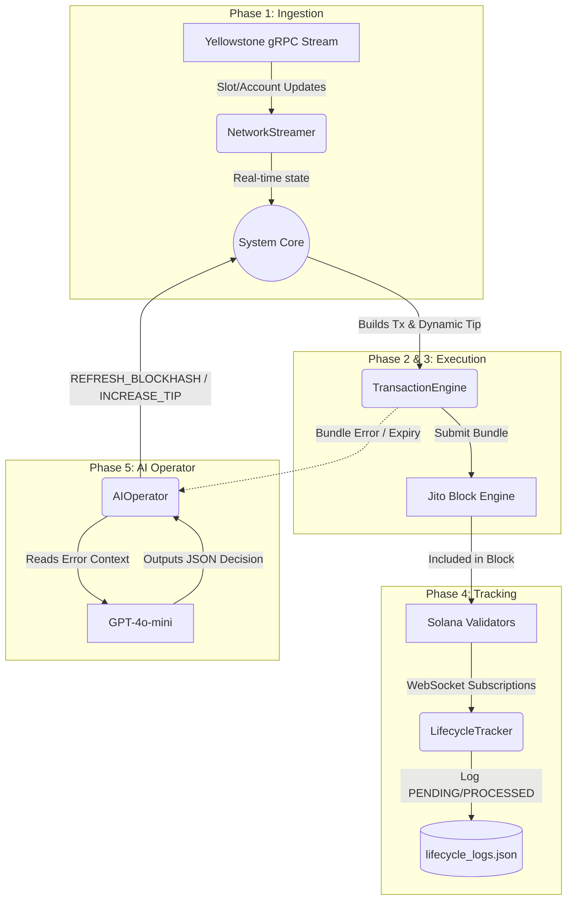

# 🏆 Solana Smart Transaction Infrastructure Stack - Execution Blueprint

## ⚠️ Core Philosophy
We will build this incrementally with a focus on **modular architecture, strict error handling, and robust typing**. This is infrastructure code, not a simple script. 

## System Components

### 1. The Ingestion Layer (gRPC Streamer)
**Purpose:** Replace RPC polling with live network telemetry.
- **Yellowstone gRPC Client:** Connects to the network stream.
- **Subscriptions:**
  - `slotUpdates`: Tracks current slot and leader schedules.
  - `accountUpdates`: Monitors Jito Tip Accounts for dynamic tip calculation.
  - `transactionUpdates`: Tracks our submitted transaction signatures natively.
- **Data Flow:** Emits structured events to the State Manager.

### 2. State Manager & Bundle Engine (Execution Layer)
**Purpose:** Constructs and routes transactions dynamically.
- **State Maintainer:** Keeps real-time track of the current slot, upcoming Jito leaders, and the rolling average of tip percentiles.
- **Tip Calculator:** Uses live account data to determine the optimal tip (no hardcoded values).
- **Bundle Builder:** Constructs transactions and packages them into Jito bundles.
- **Submission Logic:** Targets the exact leader window for the Jito validator.

### 3. Lifecycle Tracker
**Purpose:** Observes and logs the transaction journey.
- **State Machine:** Tracks transitions (`Submitted` -> `Processed` -> `Confirmed` -> `Finalized`).
- **Telemetry:** Records timestamps, slot numbers, and latency deltas between stages.
- **Failure Detection:** Identifies `Blockhash Expired`, `Fee Too Low`, etc.
- **Outputs:** Generates the required JSON Lifecycle Log.

### 4. AI Operator (The Brain)
**Purpose:** Handles autonomous retries and fault recovery.
- **Fault Injector (for testing):** Intentionally submits a bundle with an expired blockhash to trigger the flow.
- **Reasoning Engine:** Upon failure detection, ingests the error context, network state, and tip data.
- **Decision Output:** Uses an LLM (e.g., GPT-4o) to output a structured JSON command: `{"action": "REFRESH_BLOCKHASH", "tipAdjustmentFactor": 1.2, "reasoning": "..."}`.
- **Autonomous Resubmission:** The execution layer blindly follows the AI's validated JSON command to retry the transaction.

---

## 🛠️ Step-by-Step Execution Plan

### **Phase 1: Project Initialization**
1. Scaffold a clean TypeScript Node.js repository.
2. Install dependencies (`@solana/web3.js`, `@grpc/grpc-js`, Jito SDKs, OpenAI).
3. Set up environment variables (`.env`) for RPCs, gRPC endpoints, and API keys.

### **Phase 2: Build the gRPC Ingestion Layer**
1. Connect to the Yellowstone gRPC endpoint.
2. Stream `slotUpdates` and verify we are receiving live blocks.
3. Stream Jito tip accounts and calculate a running percentile.

### **Phase 3: Implement the Bundle Engine**
1. Write the logic to construct a simple SOL transfer.
2. Implement the dynamic tip calculator based on the Phase 2 stream.
3. Submit a bundle to the Jito Block Engine and verify it lands.

### **Phase 4: Implement Lifecycle Tracking**
1. Subscribe to our bundle signatures via gRPC.
2. Log the exact timestamps as the transaction moves through commitment levels.
3. Export these logs to a file to satisfy the "Lifecycle Log" requirement.

### **Phase 5: Integrate the AI Agent & Fault Injection**
1. Create a function that intentionally uses an old blockhash.
2. Catch the resulting failure in the Lifecycle Tracker.
3. Build the AI prompt and OpenAI API integration.
4. Execute the AI's recovery command autonomously.

### **Phase 6: Final Documentation & README**
1. Refine the public Architecture Document.
2. Run the full suite to generate the required 10 transaction logs (8 success, 2 failure/recovery).
3. Answer the 3 specific README questions based on observed data.

---

## System Data Flow Diagram

